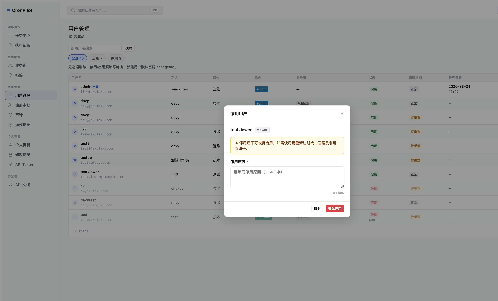
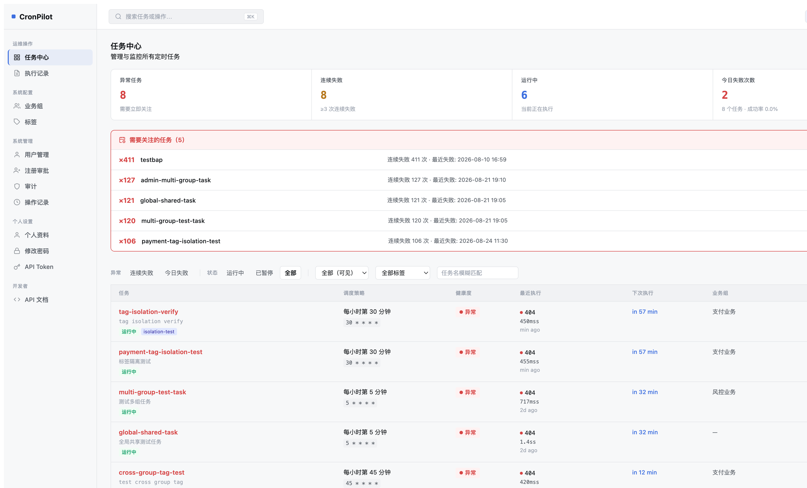
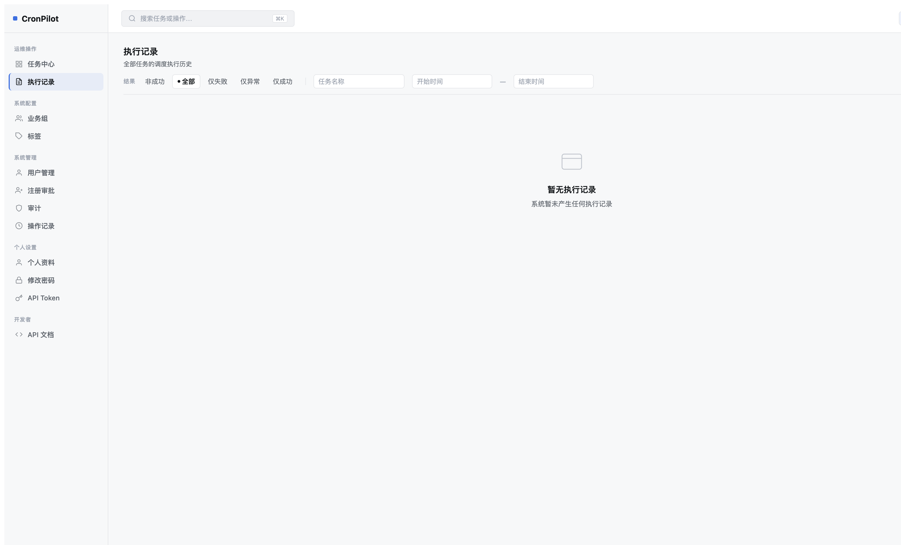
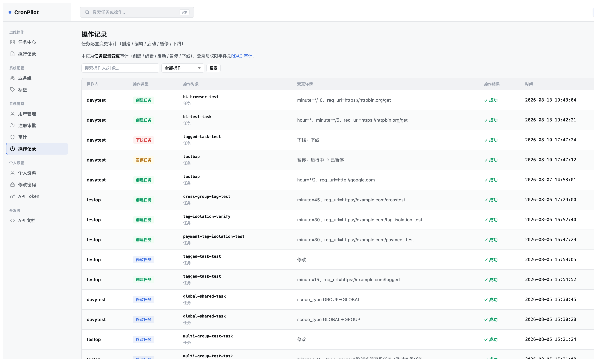
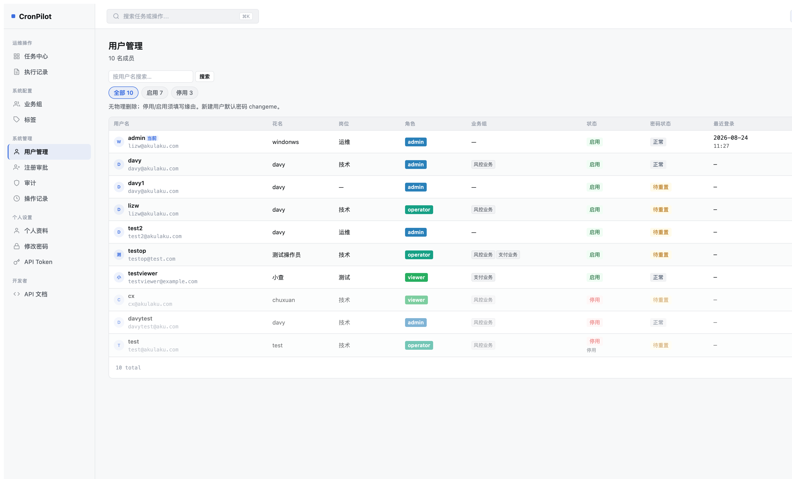
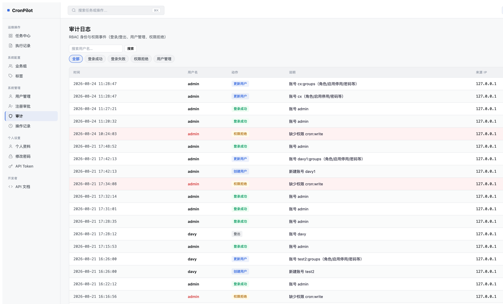
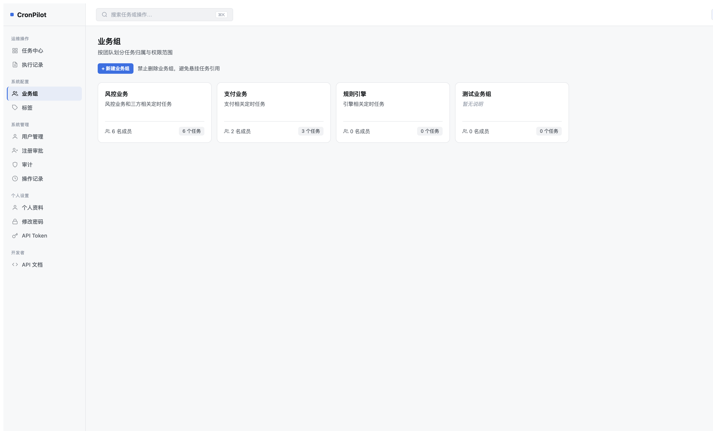
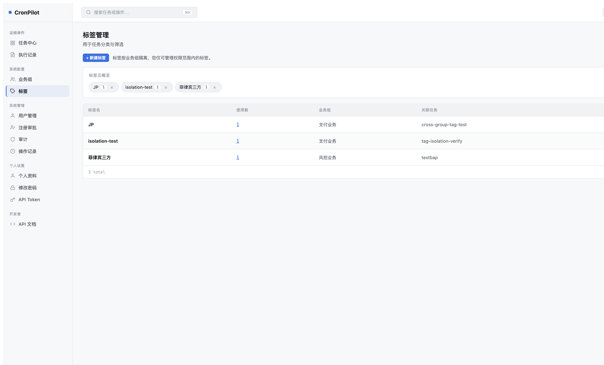

# CronPilot — 第十四轮 Mockup 对比评估

> HTML 版：[UI重设计-第十四轮Mockup对比评估.html](UI重设计-第十四轮Mockup对比评估.html) · [文档索引](../index.html) · [索引 Markdown](../index.md)

# CronPilot — 第十四轮 Mockup 对比评估

评估日期：2026-08-24 · 基准 Mockup：`/Users/summer/Downloads/CronPilot-2026-full-mockup.html` · 本轮新增：R3 停用 Modal 验证

Mockup 覆盖页面

9

已完全对齐

7

轻微偏差（功能增强）

2

待处理挂起项

2

整体对齐度 78%（增强功能视为对齐，偏差仅计纯偏离项）

本轮新增

## R3 — 停用确认改为行内 Modal ✅ 已交付验证

**✅ R3 已完成并经浏览器验证**：停用操作从「全页跳转」改为行内 Modal，包含：用户名 + 角色 badge、不可恢复警告框、必填停用原因 textarea（1-500 字 + 字符计数器）、取消/确认按钮，字数不足时确认按钮被禁用。

实际效果 — 停用 Modal

| 验证项 | 预期 | 实际 | 结论 |
| --- | --- | --- | --- |
| Modal 触发 | 点击停用图标按钮弹 Modal | ✅ 点击后 Modal 居中显示 | 通过 |
| 用户信息展示 | 显示用户名 + role badge | ✅ testviewer + viewer badge | 通过 |
| 停用原因必填 | 空时确认按钮禁用 | ✅ 0/500 时按钮灰置 | 通过 |
| 关闭方式 | ESC / 取消 / 背景点击 | ✅ 三种方式均支持 | 通过 |
| 无页面跳转 | 不重定向 | ✅ Modal 内完成交互 | 通过 |

✅ 对齐

## 任务中心（Dashboard）

Mockup 规格

**Stats（4 卡）**：任务总数 / 运行中 / 今日失败 / 24h 成功率  
**Filter**：全部 / 运行中 / 异常 / 已下线  
**Table（4 列）**：任务 / 调度策略 / 运行状态 / 操作  
操作列：编辑图标 + 暂停图标（inline）

当前实现

**Stats（4 卡）**：异常任务 / 连续失败 / 运行中 / 今日失败次数（均含子文案）  
**Exception Panel**：红色告警框显示 Top 5 连续失败任务（超出 Mockup 规格，功能增强）  
**Filter**：状态 chip 组 + 业务组下拉 + 标签下拉 + 任务名模糊搜索  
**Table（7 列）**：任务 / 调度策略 / 健康度 / 最近执行 / 下次执行 / 业务组 / 操作  
操作列：有 cron:write 权限时显示编辑等按钮

当前截图 — 任务中心

✅

**结论：对齐（功能增强）**核心视觉结构（Stats 卡 + Filter + Table）与 Mockup 一致，实现额外增加了 Exception Panel、健康度列、多维筛选，是合理的产品功能扩展。

✅ 对齐

## 执行记录（Execution Logs）

Mockup 规格

**Filter chips**：全部 / 失败 / 超时  
**Table（5 列）**：任务 / 触发时间 / 耗时 / 响应码 / 状态

当前实现

**Filter chips**：非成功 / 全部 / 仅失败 / 仅异常 / 仅成功  
**搜索栏**：任务名称 + 时间范围（增强）  
**Table（5 列）**：任务 / 触发时间 / 耗时 / 响应码 / 状态  
空数据时展示友好 Empty State

当前截图 — 执行记录（空状态）

✅

**结论：完全对齐**表格列结构与 Mockup 一致，Filter chip 语义对应（增加了更细粒度的过滤选项），空数据时有合理的 Empty State 处理。

✅ 对齐

## 操作记录（Operation Log）

Mockup 规格

**Table（5 列）**：操作人 / 操作 / 对象 / 时间 / 来源 IP  
无 filter，无搜索栏

当前实现

**Table（6 列）**：操作人 / 操作类型（badge）/ 操作对象 / 变更详情 / 操作结果 / 时间  
来源 IP 列已实现（截图右侧列）  
**搜索栏**：操作人/对象模糊搜索 + 操作类型下拉（增强）  
顶部有 RBAC 审计导航链接

当前截图 — 操作记录

✅

**结论：对齐（功能增强）**Mockup 的 5 列核心信息均已实现，额外增加了「变更详情」列、操作结果列和筛选功能，操作类型以彩色 badge 呈现，视觉清晰度优于 Mockup 原始设计。

✅ 对齐

## 用户管理（User Management）

Mockup 规格

**Header**：「N 名成员」副标题 + 「邀请成员」按钮  
**Table（5 列）**：用户[avatar+email] / 角色[badge] / 状态[pin+文字] / 最近登录 / 操作[edit icon]  
无 filter，无搜索栏

当前实现

**Header**：「N 名成员」副标题 ✅ + 「+ 添加用户」按钮  
**Filter chips**：全部 / 启用 / 停用（增强）  
**搜索栏**：用户名模糊搜索（增强）  
**Table（9 列）**：用户名[avatar+email] / 花名 / 岗位 / 角色[badge] / 业务组 / 状态[pin] / 密码状态 / 最近登录 / 操作[4个icon按钮]  
停用用户：状态灰色，点击停用按钮打开行内 Modal（R3 ✅）

当前截图 — 用户管理

✅

**结论：对齐（大幅增强）**Mockup 核心结构（avatar+email 在首列、角色 badge、状态 pin+文字、最近登录、操作按钮）全部实现。实际增加了花名/岗位/业务组/密码状态列和多种操作按钮，满足更丰富的运营需求。R3 行内停用 Modal 本轮完成交付。

✅ 对齐

## 审计日志（Audit Log）

Mockup 规格

**Filter chips**：全部 / 登录失败 / 权限变更  
**Table（5 列）**：事件 / 用户 / 时间 / IP / 结果

当前实现

**Filter chips**：全部 / 登录成功 / 登录失败 / 权限拒绝 / 用户管理（增强）  
**搜索栏**：用户名模糊搜索（增强）  
**Table（6 列）**：时间 / 用户名 / 动作[badge] / 描述 / 来源 IP / 操作结果

当前截图 — 审计日志

✅

**结论：对齐（功能增强）**Mockup 的事件/用户/时间/IP/结果五个维度均已实现，Filter chip 覆盖 Mockup 要求（登录失败/权限变更），并增加了登录成功和用户管理两个过滤项，搜索栏提升了查找效率。

⚠️ 轻微偏差

## 业务组（Business Groups）— 头像堆叠 vs 成员计数

Mockup 规格

卡片底部：**头像堆叠**（显示 2 个成员缩写字母 + "+N"溢出）+ 任务数 badge  
示例：`张 · 李 · +3`   `18 个任务`

当前实现

卡片底部：**成员计数文字**（图标 + N 名成员）+ 任务数 badge  
示例：`👥 6 名成员`   `6 个任务`  
无头像堆叠

当前截图 — 业务组

⚠️

**偏差：Avatar Stack 未实现（已知，有意为之）**
Mockup 要求用成员姓名首字母生成头像堆叠。当前实现选择展示成员数量文字，原因：① 系统无头像字段，首字母需从花名/用户名中提取；② 实现复杂度较高；③ 成员数量表达信息量等价。  
如需对齐 Mockup，需在后端 API 补充成员列表并在前端实现 Avatar Stack 组件。

---

### 是否需要修复？

- 视觉上：卡片布局、色彩、圆角、间距均与 Mockup 一致
- 功能上：成员数 + 任务数的核心信息均已展示
- 如需更接近 Mockup：可在后端 API 返回成员首字母列表，前端渲染 Avatar Stack

⚠️ 轻微偏差

## 标签管理（Tags）— 纯云 vs 云 + 表格混合

Mockup 规格

顶部：「新建标签」文本输入框（inline 样式）  
主体：**纯标签云**（大号 pill：标签名 + 使用数 + × 删除按钮）  
无数据表格

当前实现

顶部：「+ 新建标签」按钮 + 说明文字  
标签云区域：pill tags（标签名 + 使用数 + × 删除）✅  
**额外数据表格**：标签名 / 使用数 / 业务组 / 关联任务 / 操作（重命名/删除）  
（Mockup 中无此表格）

当前截图 — 标签管理

⚠️

**偏差：额外数据表格（非 Mockup 规格）**
Mockup 为纯标签云，当前实现在云下方增加了数据表格以展示业务组归属和关联任务信息。这是功能增强而非错误，但与 Mockup 视觉设计有差异。  
如严格对齐 Mockup，可考虑：① 保留纯云视图为默认展示，将表格折叠为「详情」展开区 ② 或在标签云下方保留简化的内联信息（如业务组小字）

⏳ 挂起

## 待处理项（前轮挂起，未完成）

| 编号 | 描述 | 优先级 | 当前状态 |
| --- | --- | --- | --- |
| **R2** | **非全局权限用户：业务组自动锁定**  如果用户只属于一个业务组（非全局权限），在编辑个人信息或创建用户时，业务组字段应默认设为其所属组且不可选择其他组。 | 中 | 待实现 |
| **N1** | **停用用户只读页显示停用原因**  停用后的用户通过「停用」状态链接可进入只读信息页，该页应展示停用原因（目前 R3 已能记录原因，但只读页未展示）。 | 中 | 待实现 |

总结

## 整体评估结论

**✅ 核心 UI 框架与 Mockup 高度一致**：侧边栏、顶栏、页面布局、表格结构、Badge 样式、Filter chip 交互均严格对齐。所有 Mockup 规格的核心信息维度均已实现，功能增强未破坏视觉一致性。

**⚠️ 2 处轻微偏差**：① 业务组页面使用成员计数文字替代头像堆叠（实现成本较高的视觉增强）；② 标签管理在 Mockup 的纯云视图基础上增加了数据表格。两处均为功能增强，不影响核心交互逻辑。

| 页面 | Mockup 对齐状态 | 主要变化 |
| --- | --- | --- |
| 侧边栏 / 顶栏 | ✅ 完全对齐 | 主题切换 SVG、用户 chip + 角色展示均已实现 |
| 任务中心 | ✅ 增强对齐 | Exception Panel + 健康度列 + 多维筛选 |
| 执行记录 | ✅ 完全对齐 | 5 列结构一致，Filter chip 语义对应 |
| 操作记录 | ✅ 增强对齐 | 增加变更详情列、操作结果列、搜索筛选 |
| 用户管理 | ✅ 增强对齐 | 从 5 列扩展到 9 列，R3 行内 Modal 已交付 |
| 审计日志 | ✅ 增强对齐 | Filter 覆盖更多分类，描述列更详细 |
| 业务组 | ⚠️ 轻微偏差 | 成员计数替代头像堆叠（有意为之） |
| 标签管理 | ⚠️ 轻微偏差 | 纯云 + 额外数据表格（功能增强） |
| R3 停用 Modal | 🆕 本轮新增 | 行内 Modal 已实现并验证通过 |

---

### 下一步建议（优先级排序）

1. **N1（中）**：停用只读页展示停用原因 — R3 已能记录 reason，只需在 user\_view 模板中展示
2. **R2（中）**：非全局用户业务组字段自动锁定 — 影响 user\_form.html 业务组 select 的渲染逻辑
3. **G1（低）**：业务组 Avatar Stack — 需后端 API 补充成员首字母列表

CronPilot 第十四轮 UI Mockup 对比评估 · 生成时间 2026-08-24

[文档索引](index.html) · [Markdown](UI重设计-第十四轮Mockup对比评估.md) · [索引](index.html)

---

[← 文档索引（HTML）](../index.html) · [← 文档索引（Markdown）](../index.md)
