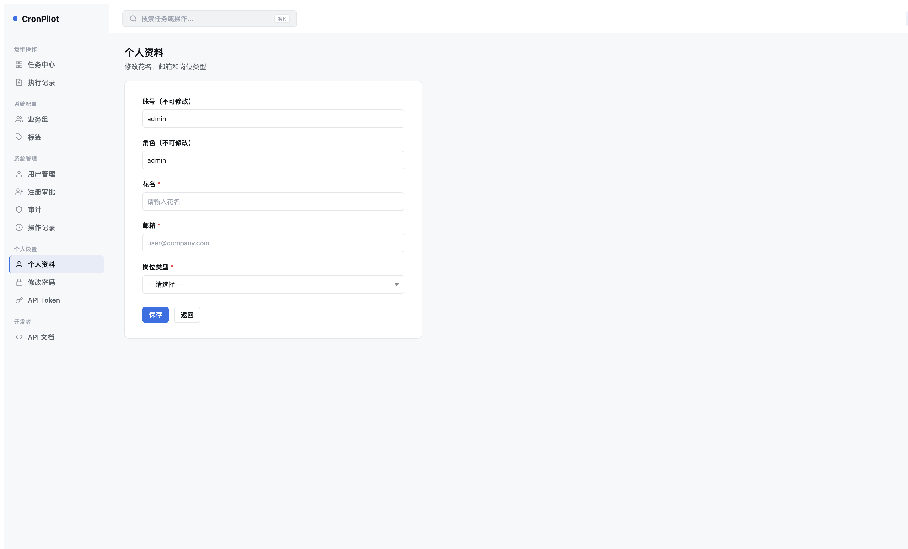
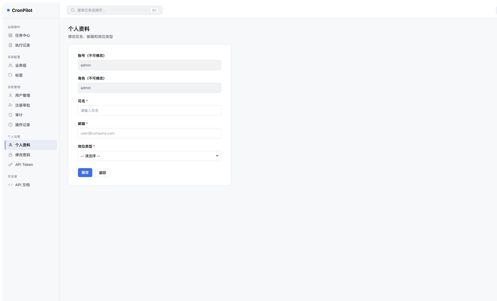
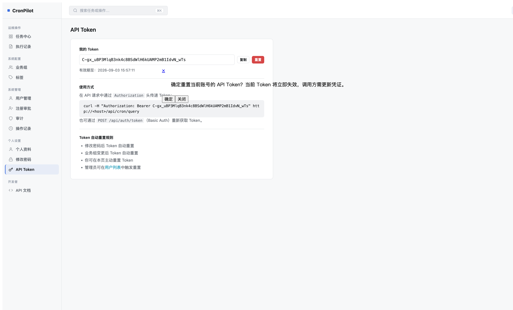
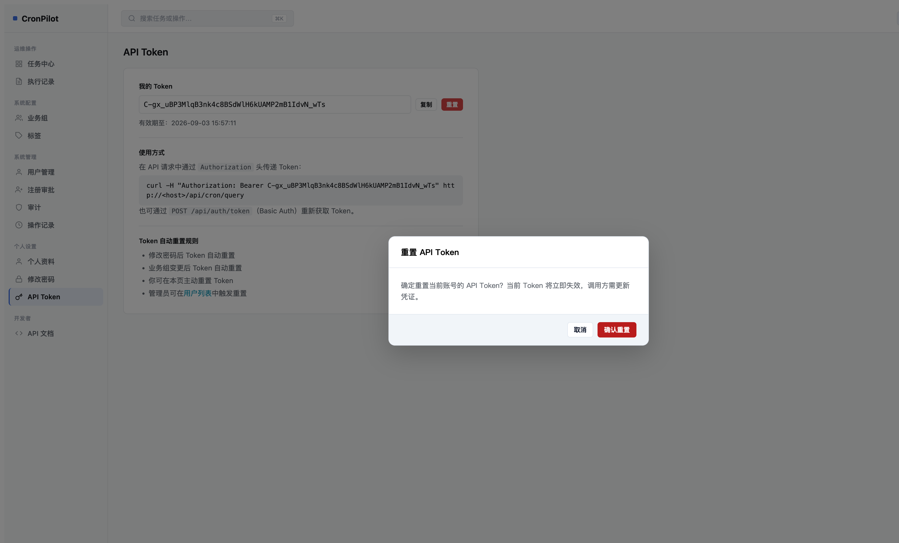
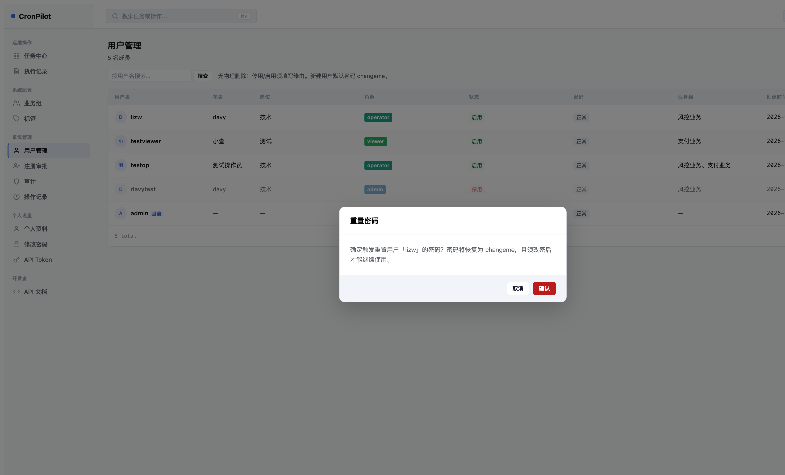

# 复盘：确认对话框显示异常 & 个人资料页新增 — 2026-08

> HTML 版：[2026-08-确认对话框修复与个人资料页.html](2026-08-确认对话框修复与个人资料页.html) · [文档索引](../index.html) · [索引 Markdown](../index.md)

# 复盘：确认对话框显示异常 & 个人资料页新增

日期：2026-08-20  | 
影响版本：[Unreleased]  | 
Bug Fix
New Feature

## 一、个人资料编辑页（Y1 新功能）

用户反馈「个人设置」区域缺少修改自己花名、邮箱、岗位等信息的入口，仅有修改密码和 API Token，无法自助维护个人信息。

### 实现内容

- 新路由 `GET/POST /rbac/profile`，已登录用户均可访问
- 新服务函数 `update_own_profile(user_id, email, nickname, job_title)`，含完整校验
- 新模板 `redesign/user_profile.html`，与 `change_password.html` 同卡片风格
- 侧边栏「个人设置」节新增「个人资料」入口（全角色可见）
- 只读字段（账号、角色）统一置灰：`--cp-surface-2` 背景 + `--cp-text-muted` 文字 + `cursor: not-allowed`

### 验收截图



个人资料页 — 初始状态（字段空白）



账号/角色字段置灰（不可修改），花名/邮箱/岗位可编辑

✓ 侧边栏回归测试 12 用例全绿（admin 12项，operator 7项，viewer 6项）

## 二、确认对话框显示异常修复

### Bug 定位

| 文件 | 位置 | 问题 |
| --- | --- | --- |
| `redesign-confirm.js` | 第 45、53-55 行 | 按钮类名使用 Bootstrap `btn btn-danger` / `btn btn-ghost`，Redesign CSS 未定义这些类 → 按钮无样式 |
| `redesign/api_token.html` | 第 14 行「重置」按钮 | 使用 `js-ajax-dialog-btn` 触发旧 `artDialog` → tooltip 贴着按钮弹出，遮盖内容 |
| `redesign/users.html` | 第 87-98 行图标按钮 | 「重置密码」「重置 API Token」同样使用 `js-ajax-dialog-btn` → artDialog 内联弹出 |

### 根因

`redesign-confirm.js` 作为新模块编写时，按钮类名沿用了 Bootstrap 命名约定（`btn btn-danger`），未对齐 Redesign 体系的 `btn-c btn-danger-c`。`api_token.html` 和 `users.html` 从 v1 模板迁移到 redesign 时，直接复用了 `js-ajax-dialog-btn` 机制，未切换到 `CpConfirm.show()`。

### 测试漏洞

`test_ajax_form_guard.py` 仅检查 POST 防重复提交，不覆盖「点击后弹框的 DOM 结构和 CSS class 属性值」。无 E2E 测试验证 `CpConfirm` 按钮外观。

### 对比截图



修复前：artDialog 贴着按钮弹出，覆盖正文



修复后：居中模态框 + 半透明遮罩（API Token 重置）



修复后：用户管理页「重置密码」模态框，正确样式按钮

### 修复内容

| 文件 | 变更 |
| --- | --- |
| `app/static/js/redesign-confirm.js` | `btn btn-danger` → `btn-c btn-danger-c`；`btn btn-ghost` → `btn-c btn-line` |
| `app/templates/redesign/api_token.html` | 「重置」改为 `<button id="tk-reset-btn">` + JS 调用 `CpConfirm.show()`，POST form 提交 |
| `app/templates/redesign/users.html` | 「重置密码」「重置 API Token」移除 `js-ajax-dialog-btn`，改用 `um-confirm-action` 类 + 委托事件调用 `CpConfirm.show()` |

### 同类排查

```
grep -r "js-ajax-dialog-btn" app/templates/redesign/
```

✓ 无结果 — Redesign 模板中已无残留 artDialog 调用

旧 v1 模板（`app/templates/rbac/`）继续使用 artDialog，不影响 Redesign UI。

### 预防方案

| 措施 | 落地位置 | 验证命令 |
| --- | --- | --- |
| Redesign 页面禁止使用 `js-ajax-dialog-btn` 规范 | `AGENTS.md`、`.cursor/rules/cronpilot-project.mdc` | `grep -r "js-ajax-dialog-btn" app/templates/redesign/ && echo "FAIL" || echo "OK"` |
| 新增 `redesign-confirm.js` 按钮类名 lint 检查 | 可加入 `scripts/check_ui_contract.py` | `grep "btn btn-danger\|btn btn-ghost" app/static/js/redesign-confirm.js && echo "FAIL" || echo "OK"` |

## 三、涉及文件清单

- `app/rbac/services.py` — 新增 `update_own_profile()`
- `app/rbac/views.py` — 新增 `/rbac/profile` 路由
- `app/templates/redesign/user_profile.html` — 新建模板
- `app/templates/redesign/_sidebar.html` — 新增「个人资料」导航项
- `app/static/js/redesign-confirm.js` — 修复按钮 CSS 类名
- `app/templates/redesign/api_token.html` — 重置按钮改用 CpConfirm
- `app/templates/redesign/users.html` — 图标按钮改用 CpConfirm
- `tests/test_redesign_sidebar.py` — 更新导航项计数（12/7/6）
- `RELEASE_NOTES.md`、`AGENTS.md`、`.cursor/rules/cronpilot-project.mdc` — 文档同步

[文档索引](index.html) · [Markdown](2026-08-确认对话框修复与个人资料页.md) · [索引](index.html)

---

[← 文档索引（HTML）](../index.html) · [← 文档索引（Markdown）](../index.md)
